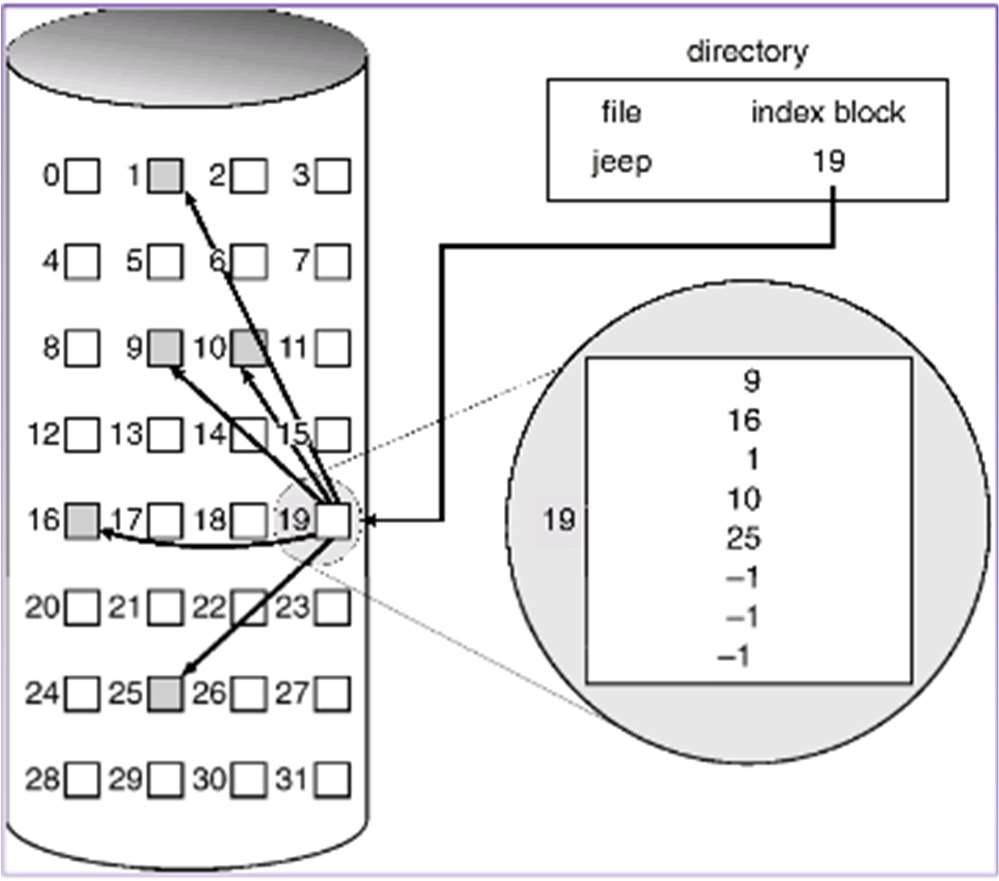

# 文件系统

在操作系统中，文件是指具有文件名的一组相关元素的有序序列，是一段程序或数据的集合，而文件系统是操作系统的一部分，主要功能是管理存储在磁盘 等物理介质中的文件的存储、检索、更新，提供安全可靠的共享和保护手段，并且方便用户使用。

文件如何存储在磁盘上呢?磁盘可以看成一个个磁盘块(扇区)组成，每个磁盘块的大小固定(512B-4K)，因此存储文件的一个关键就是记录文件在哪些磁盘块上。通常有三种方法来分配和记录文件的磁盘块，连续分配、链表分配和索引分配。

从图中可以看出，文件有索引节点描述，可以读 index block 中的数据，可以得到 jeep 文件所在的块分别是： 9, 16, 1, 10, 25，将他们连起来就是 jeep 文件的全部内容。

典型的 linux 文件系统中磁盘主要包括四个区域：启动区、超级块 (superblock)区、索引节点(inode)区和数据(data block)区。

- 超级块区：超级块区中存储两个位图(bitmap)，分别用来表示索引结点和数据块的使 用情况。索引结点位图中的每个 bit 表示对应的索引结点是否占用，数据块位图 中的每个 bit 表示对应的数据块是否占用。

- 索引节点区：每个索引结点中存储着一个文件或目录的描述信息，每个文件和目录都有一个 inode 数据结构，包括文件系统中文件的基本属性：文件大小、inode 号、存放的 block 数目和具体 block 编号等相关信息。 0 号索引结点中存储的是根目录的信息，应在格式化时设置。

- 数据区：存放文件的内容，若文件过大，会占用多个 block。每个目录下均有一个名称为“.”的目录，即为本身。除根目录外，每个目录下均有一个名称为“..”的目录，即为上级目录。

就像一本书有封面、目录和正文一样。在文件系统中，超级块就相当于封面，从封面可以得知这本书的基本信息；inode 块相当于目录，从目录可以得知各章 节内容的位置；而数据块则相当于书的正文，记录着具体内容。

