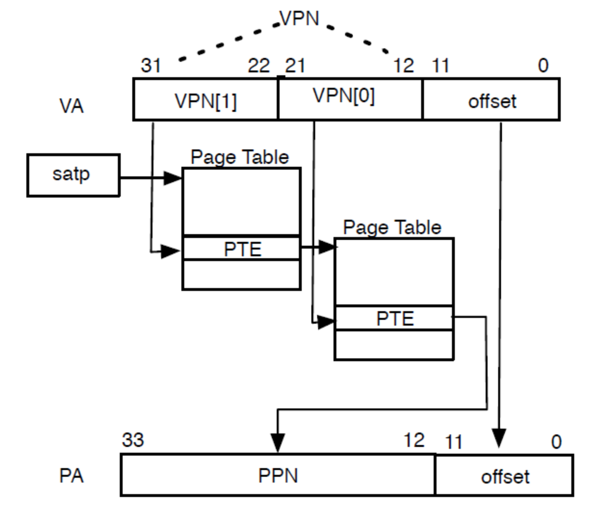

# 页表

## 概要

本章我们将介绍一种常见的内存管理方式：分页。页表是为了实现分页而创建的数据结构，直观来看，其功能就是将虚拟地址转换为物理地址。围绕这些内容，我们将介绍：

1. 什么是虚拟地址。

2. 什么是分页。

3. 页面和页表的结构。

4. 如何通过页表将虚拟地址转换为物理地址。

## 虚拟地址

操作系统的一个主要任务是将程序彼此隔离。比如，你在浏览网页时，并不应该干扰你的文本编辑器。而在编写浏览器或文本编辑器的时候，必然会需要对内存进行操作。然而编写文本编辑器的人也许并不认识编写浏览器的人。所以他们并不知道对方需要使用那部分的内存。

让我们先来看一个例子，在 C++ 文件中输入以下代码：
```
#include <iostream>
using namespace std;

int main() {
    int a = 1;
    int *p = &a;
    cout << p << endl;
    return 0;
}
```

编译运行，在我的电脑（64 位）中，输出的结果是 `0x7ffeefbff5c8` ，这里输出的地址叫做虚拟地址。在计算机真实访问内存的时候，并不会直接访问 `0x7ffeefbff5c8` 这个物理地址，而是先进行一个转换。可假想这个转换有一个函数，叫 `virtual2physical(address)` ，那么实际访问的内存则是： `virtual2physical(0x7ffeefbff5c8)` 。虚拟地址可能是不唯一的，但物理地址一定是唯一的。比如，不同的虚拟地址，可能可以转换成同一个物理地址（这类似一个哈希的过程）。这样，程序员在编写程序时，并不需要考虑内存冲突的问题，因为操作系统会给他分配一片“连续的虚拟内存”（即便他们的物理地址不一定连续）。

## 分页

分页技术的核心思想是将虚拟内存空间和物理内存空间划分成固定大小的小块，虚拟内存空间的块称为 **页面（pages）** ，物理地址空间的块称为 **帧（frames）** ，每一个页都可以映射到一个帧上。在 RISCV32 架构中，每个页面的大小为 4kb 。所以这意味着我们有数以百万计的 **页面** 映射到了 **帧** 。为此我们需要使用 **页表（page table）** 来存放映射信息。 

## 页表

虽然大家都叫他页表，但是这里叫 **页目录** 似乎更加贴切。（不过因为需要从众我也叫他页表吧
> 请牢记 **页目录** 这个词，这有利于后续对页表的理解

**页表可以理解为数组，数组的每一项都是一个页面（或者下一级页表）的地址。**

从上面的那句话我们知道：页表可以分为多级。我们先来看最简单的一级页表是如何实现地址转换的。
> 实际上并没有一级页表，因为这完全没有考虑页面的读写权限等，只是我想象出来的用于理解的情况

首先，在全局只有一个 **根页表** ，这里的 **根页表** 就是这个一级页表。我们随便选一个虚拟地址作为计算示例：`0xffeeffee` 。

首先将这个地址转为二进制，并且分为前 20 位和后 12 位：`b11111111111011101111_111111101110`
> 用 16 进制表示就是 `0xffeef_fee` 。

我们需要通过前 20 位找到所需 **物理地址** 所在的 **页面** ，然后通过后 12 位找到这个 **物理地址** 在页面中的具体位置。因为，后 12 位也有一个形象的名字：页内偏移（offset）。

前面我们讲过，页表可以理解为数组。假想这个数组（pg_table）的每一项大小都为 4kb ，那么我们需要找的页面就为： `pg_table[0xffeef]` 。

访问的物理地址为：
```
typedef unsigned int uintptr_t;
uintptr_t(&pg_table[0xffeef]) + 0xfee;
```
## 二级页表

riscv32 框架采用了二级页表。我们先来看一看在二级页表中虚拟地址长什么样：


VPN 表示 virtual page number 。由于我们采用了多级页表，所以需要引入 **页表项（page table entry）** ，简称 pte 。其结构如下：
> 直译为页目录入口似乎更加形象


PPN 表示 physical page number 。pte 的大小也为 32 位，与虚拟地址位数相同。不同的是，他存放了 22 位的物理地址（PPN）和 10 位的各类页面状态。

riscv 中， satp（Supervisor Address Translation and Protection，监管者地址转换和保护）寄存器的低 22 位保存了 **根页表** 的物理地址（类似于 X86 的 CR3 寄存器）。
> 32 位下根页表为二级页表，64 位下根页表为四级页表

现在我们来演示如何通过二级页表将虚拟地址 `0xffeeffee` 转换为物理地址：

1. 通过 satp 获取二级页表的基址(satp.PPN)，VPN[1]给出了二级页号，因此处理器会读取位于地址（satp.PPN * PAGE_SIZE + VPN[1] * PTE_SIZE）的页表项。

2. 该 pte 包含一级页表的物理地址，VPN[0]给出了一级页号，因此处理器读取位于地址（pte.PPN * PAGE_SIZE + VPN[0] * PTE_SIZE）的叶节点页表项(leaf_pte)。

3. 叶节点页表项的 PPN 字段和页内偏移（原始虚拟地址的低 12 位）组成了最终的物理地址：leaf_pte.PPN * PAGE_SIZE + page_offset 。

> 在 riscv32 中，PAGE_SIZE = 4096，PTE_SIZE = 4

该过程可由下图表示：



> 这个转换过程并不严谨，后续我们将对其进行补充

## 实现

其实我们的 os 已经通过 bbl 开启了分页机制，我们只需要进行一些简单的设置即可。

首先创建 **memory/mod.rs** ，并在 **lib.rs** 中加入 `mod memory` 。

内存的初始化如下：
```
pub fn init(dtb : usize) {
    unsafe {
        // Allow user memory access
        sstatus::set_sum();
    }
}
```

这里我们将 sum 位设为 1 。sum（permit supervisor user memory access）位修改 S 模式读、写和指令获取访问虚拟内存的权限。仅当 sum = 1 时则允许在 S 模式下访问属于 U 模式（U = 1）的内存，否则会产生异常。
> 这一步现在还不是必须的，要到用户程序时才能体现出作用

有了页表，自然会有页面异常，比如在读、写等操作时缺少权限：
```
pub enum PageFault{
    LoadPageFault,
    StorePageFault,
}

use crate::context::TrapFrame;
pub fn do_pgfault(tf: &mut TrapFrame, style: PageFault) {
    match style {
        PageFault::LoadPageFault => panic!("load pagefault"),
        PageFault::StorePageFault => panic!("store pagefault"),
    }
}
```

由于我们目前还无法处理这些异常，所以先简单的 panic 处理。

在 **init.rs** 中加入 `use crate::memory::init as memory_init` ，修改 rust_main 为：
```
#[no_mangle]
pub extern "C" fn rust_main(hartid : usize, dtb : usize) -> ! {
    interrupt_init();
    println!("Hello RISCV ! in hartid {}, dtb @ {:#x} ", hartid, dtb);
    memory_init(dtb);
    clock_init();
    let x_ptr: *mut u32 = 0x666 as *mut u32;
    unsafe {
        println!("{:#x}", *x_ptr);
    }
    loop {}
}
```

bootloader 约定了传给 rust_main 的参数。 hart(hardware thread) 是硬件线程，显然的 hartid 应该为 0 （最先创建的线程）。dtb 为 device tree block ，即被存储在内存中的 device tree 。

执行 make run ，不出所料，出现了异常：
```
panicked at 'load pagefault', src/memory/mod.rs:17:37
```

执行 make asm ，下面只展示部分输出：
```
c0020000 <_start>:
c0020000:       00150293                addi    t0,a0,1
c0020004:       01029293                slli    t0,t0,0x10
c0020008:       c0026137                lui     sp,0xc0026
c002000c:       00010113                mv      sp,sp
c0020010:       00510133                add     sp,sp,t0
c0020014:       00000097                auipc   ra,0x0
c0020018:       008080e7                jalr    8(ra) # c002001c <rust_main>

c002001c <rust_main>:
c002001c:       ef010113                addi    sp,sp,-272 # c0025ef0 <ebss+0xfff7feec>
c0020020:       10112623                sw      ra,268(sp)
c0020024:       10812423                sw      s0,264(sp)
c0020028:       11010413                addi    s0,sp,272
c002002c:       f2b42a23                sw      a1,-204(s0)
...
```
> make asm 的作用是通过反汇编显示程序执行的汇编代码

显然，这些存放指令的地址是可读的。我们随便选择一条指令存放的地址，比如将代码改为：`let x_ptr: *mut u32 = 0xc0020020 as *mut u32` 。

执行 make run ，终端输出 `0x10112623` 。发现，这与我们通过反汇编得到的指令是一致的。这说明我们成功的通过页表正确的访问到了内存。

## 预告

本章我们实现了分页机制，并且对物理地址和虚拟地址有了一定的了解。下一章我们将探测可分配物理内存，并实现物理内存的分配和释放。