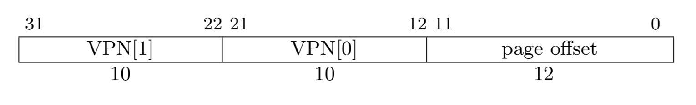
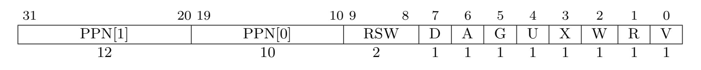

# 页表

## 概要

本章我们将介绍一种常见的内存管理方式：分页。页表是为了实现分页而创建的数据结构，直观来看，其功能就是将虚拟地址转换为物理地址。本章我们将学习：

1. 什么是虚拟地址。

2. 什么是页表。

3. 页目录和页表。

4. 通过 bbl 中建立的简陋的页表加深对页表的理解。

## 虚拟地址

操作系统的一个主要任务是将程序彼此隔离。比如，你在浏览网页时，并不应该干扰你的文本编辑器。而在编写浏览器或文本编辑器的时候，必然会需要对内存进行操作。然而编写文本编辑器的人也许并不认识编写浏览器的人。所以他们并不知道对方需要使用那部分的内存。

让我们先来看一个例子，在 C++ 文件中输入以下代码：
``` C++
#include <iostream>
using namespace std;

int main() {
    int a = 1;
    int *p = &a;
    cout << p << endl;
    return 0;
}
```

编译运行，在我的电脑（64 位）中，输出的结果是 `0x7ffeefbff5c8` ，这里输出的地址叫做虚拟地址。在计算机真实访问内存的时候，并不会直接访问 `0x7ffeefbff5c8` 这个物理地址，而是先进行一个转换。可假想这个转换有一个函数，叫 `virtual2physical(address)` ，那么实际访问的内存则是： `virtual2physical(0x7ffeefbff5c8)` 。

虚拟地址可能是不唯一的，但物理地址一定是唯一的。比如，不同的虚拟地址，可能可以转换成同一个物理地址（这类似一个哈希的过程）。这样，程序员在编写程序时，并不需要考虑内存冲突的问题，因为操作系统会给他分配一片“连续的虚拟内存”（即便他们的物理地址不一定连续）。
> 这段话看不懂没关系，以后学到了进程线程可能就懂了

## 页表

页表就是一个用于将虚拟地址转换为物理地址的工具。在 riscv32 中，如果 satp 的第 31 位为 1 ，则表示启用页表机制。在访问虚拟内存时（开启页表时只允许访问虚拟内存），内存管理单元 MMU(Memory Management Unit) 会用过页表将虚拟地址转换为物理地址，再进行访问，

分页技术的核心思想是将虚拟内存空间和物理内存空间视为固定大小的小块，虚拟内存空间的块称为 **页面（pages）** ，物理地址空间的块称为 **帧（frames）** ，每一个页都可以映射到一个帧上。

riscv32 框架下，每个页面的大小为 4kb 。虚拟地址可以分为两部分， **VPN（virtual page number）** 和 **page offset** ：



他们的作用如下：

- 通过页表，将 VPN 转换为目标物理地址所处的页面
- 通过 page offset 在页面中找到具体的物理地址

由于页面大小为 4kb ，所以为了能够访问页面中的任意物理位置， page offset 的长度为 12 位。
> 2^12 byte = 4kb

## 二级页表

riscv32 框架采用了二级页表。一个进程只有一个 **根页表** ，不同的进程有不同的 **根页表** ，所以对于不同的进程，相同的虚拟地址可以转换到不同的物理地址。

**根页表** 也称为 **页目录** 。二级页表地址的虚实转换可以简要的比喻为：

- 通过页表，将 VPN 转换为目标物理地址所处的页面

    1. 通过 **页目录** 和 **VPN[1]** 找到所需 **页目录项** 。
    2. **页目录项** 包含了 **叶结点页表（简称页表）** 的起始地址，通过 **页目录项** 找到 **页表**。
    3. 通过 **页表** 和 **VPN[0]** 找到所需 **页表项** 。
    4. **页表项** 包含了目标页面的起始物理地址，通过 **页表项** 找到目标页面。

- 通过 page offset 在页面中找到具体的物理地址

> 页表中保存的地址均为物理地址

## bbl 中的页表

其实我们的 os 已经通过 bbl 开启了分页机制：
``` rust
// in ../riscv-pk/bbl/bbl.c

static void setup_page_table_sv32()
{
  // map kernel 0x80000000 -> 0xC0000000..
  int i_end = dtb_output();
  for(unsigned int i = 0x80000000; i <= i_end; i += MEGAPAGE_SIZE) {
    root_table[(i + 0x40000000) / MEGAPAGE_SIZE] = pte_create(i >> 12, PTE_R | PTE_W | PTE_X);
  }
}
```
> 这个页表极其简陋，下一章将重新建立页表

这里 bbl 似乎只设置了页目录，没有设置页表，会出问题吗？

其实不会，在 x86 中，有一种类型的页表叫做 **大页** ，并且页表项中专门有一位用于判断页面是否为大页。而 riscv 中则由别的做法。 riscv32 中，页表项的结构如下：



- 如果 X, W, R 位均为 0 ，则表示这是一个页目录项，包含了下一级页表的物理地址。
- 否则表示这是一个页表项，包含了页面的物理地址。

下面给出 XWR 位为不同值时表达的意思：

|X|W|R|Meaning|
|:-:|:-:|:-:|:-|
|0|0|0|Pointer to next level of page table|
|0|0|1|Read-only page|
|0|1|0|Reserved for future use|
|0|1|1|Read-write page|
|1|0|0|Execute-only page|
|1|0|1|Read-execute page|
|1|1|0|Reserved for future use|
|1|1|1|Read-write-execute page|

因此，在 bbl 中， **根页表** 指向的地方是一个页面，而且是一个大页。

riscv 中， satp（Supervisor Address Translation and Protection，监管者地址转换和保护）寄存器的低 22 位保存了 **根页表** 的物理地址（类似于 X86 的 CR3 寄存器）。
> 32 位下根页表为二级页表，64 位下根页表为四级页表

我们可以通过 satp 寄存器获得页目录的物理地址。但是由于我们开启了页表机制，所以并不能通过直接访问到物理地址。为了能够直接对页表进行一些操作，由两种常见的办法：自映射和线性映射。bbl 中建立的页表就是线性映射的。
> 自映射真是太难了（小声bb

线性映射页表中，虚拟地址和物理地址的关系如下：

virtual address = physical address + offset

内核的起始地址为 0x80000000，bbl 中建立的页表的将其映射到 0xC0000000 ，所以 offset 为 0x40000000 。

基于 bbl 建立的页表，我们只需要进行一些简单的设置：

首先创建 **memory/mod.rs** ，并在 **lib.rs** 中加入 `mod memory` 。

内存的初始化如下：
``` rust
pub fn init(dtb: usize) {
    unsafe {
        // Allow user memory access
        sstatus::set_sum();
    }
}
```

这里我们将 sum 位设为 1 。sum（permit supervisor user memory access）位修改 S 模式读、写和指令获取访问虚拟内存的权限。仅当 sum = 1 时则允许在 S 模式下访问属于 U 模式（U = 1）的内存，否则会产生异常。
> 这一步现在还不是必须的，要到用户程序时才能体现出作用

有了页表，自然会有页面异常，比如在读、写等操作时缺少权限：
``` rust
pub enum PageFault{
    LoadPageFault,
    StorePageFault,
}

use crate::context::TrapFrame;
pub fn do_pgfault(tf: &mut TrapFrame, style: PageFault) {
    match style {
        PageFault::LoadPageFault => panic!("load pagefault"),
        PageFault::StorePageFault => panic!("store pagefault"),
    }
}
```

由于我们目前还无法处理这些异常，所以先简单的 panic 处理。

在 **init.rs** 中加入 `use crate::memory::init as memory_init` ，修改 rust_main 为：
``` rust
#[no_mangle]
pub extern "C" fn rust_main(hartid: usize, dtb: usize) -> ! {
    interrupt_init();
    println!("Hello RISCV ! in hartid {}, dtb @ {:#x} ", hartid, dtb);
    memory_init(dtb);
    clock_init();
    loop {}
}
```

执行 make asm ，下面只展示部分输出：
```
c0020000 <_start>:
c0020000:       00150293                addi    t0,a0,1
c0020004:       01029293                slli    t0,t0,0x10
c0020008:       c0026137                lui     sp,0xc0026
c002000c:       00010113                mv      sp,sp
c0020010:       00510133                add     sp,sp,t0
c0020014:       00000097                auipc   ra,0x0
c0020018:       008080e7                jalr    8(ra) # c002001c <rust_main>

c002001c <rust_main>:
c002001c:       ef010113                addi    sp,sp,-272 # c0025ef0 <ebss+0xfff7feec>
c0020020:       10112623                sw      ra,268(sp)
c0020024:       10812423                sw      s0,264(sp)
c0020028:       11010413                addi    s0,sp,272
c002002c:       f2b42a23                sw      a1,-204(s0)
...
```
> make asm 的作用是通过反汇编显示程序执行的汇编代码

显然，这些存放指令的地址是可读的。
> 由于 bbl 中建立的页表太简陋了，这部分目前甚至是可写的。。。

我们随便选择一条指令存放的地址，在 `loop{}` 前加上：`let x_ptr: *mut u32 = 0xc0020020 as *mut u32` 。

执行 make run ，终端输出 `0x10112623` 。发现，这与我们通过反汇编得到的指令是一致的。这说明我们成功的通过页表正确的访问到了内存。

## 预告

前面多次提到 bbl 中建立的页表过于简陋，比如代码段居然是 **可写** 的！而且相信大家看完文字描述的页表机制，依然不能很好的理解页表。。。
> 反正我不能。。。我在没写过页表的时候就把这篇文章写完了，但是动手实现完页表之后发现自己之前写的文章错漏百出而且让人看不懂。。。你现在看到的这一篇是我重写的。。。

所以接下来，让我们将理论与实践相结合，自己动手实现页表！
